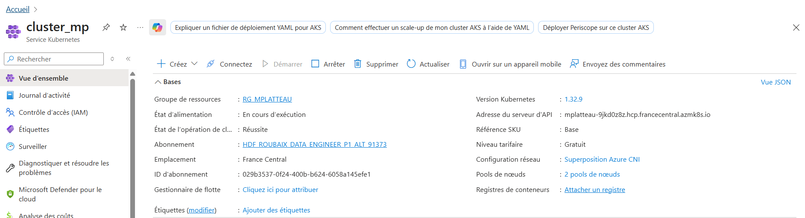
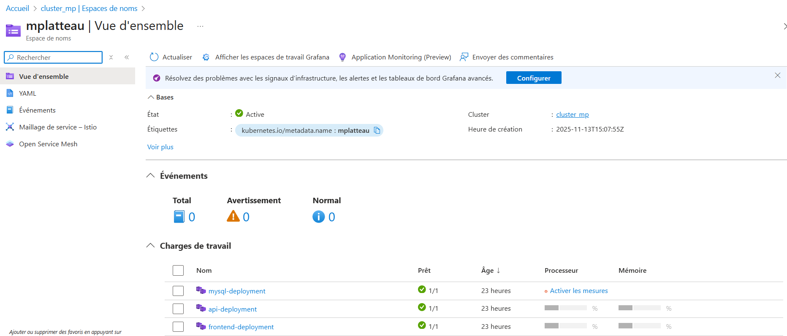
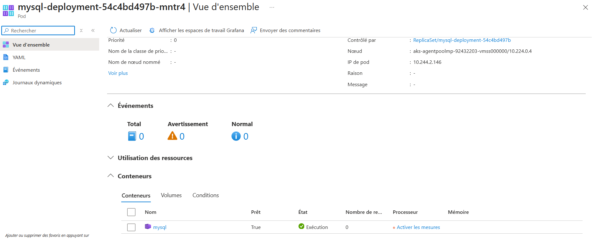
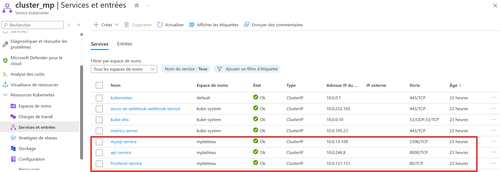
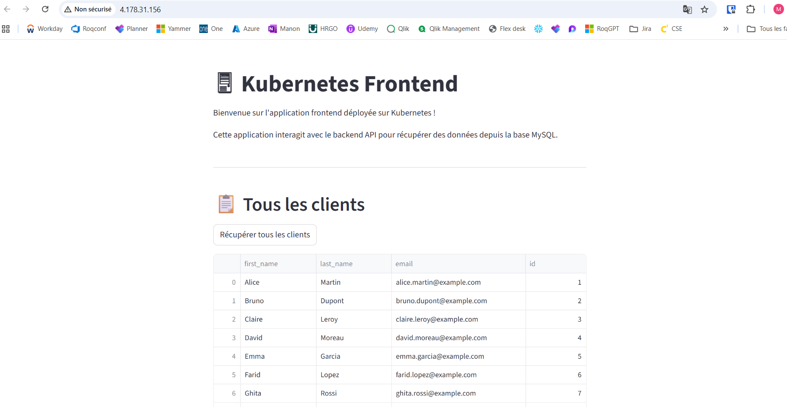
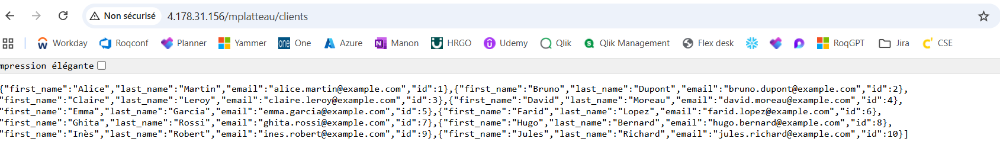

# Kubernetes 

## Volume et persistance 

1. Quel est le rôle d'un volume dans un déploiement Kubernetes ?

Lorsqu'on déploie des containers, les fichiers on-disk sont éphémères. Si le containuer crash, l'état du container (et de ses fichiers) n'est pas sauvegardé et les données sont perdues. Un volume permet de stocker des données accessibles par le container et permet également d'avoir des données accessibles par plusieurs containers d'un même pod ou de pods différents. Ainsi, les données restent accessibles même si le pod est redémarré ou déplacé. 
Un volume permet donc la **persistance des données** et le **partage des données**.

Il existe différents types de volume : 
- volume persistant : durée de vie non liée à un pod spécifique. Si le pod est supprimé, le volum persistant ne l'est pas.
- volume éphémère : durée de vie liée à un pod, si le pod est supprimé, le volume éphémère est supprimé également.

Pour utiliser un volume, il faut le définir au niveau du pod dans `.spec.volumes` et déclarer où sont montés ces volumes dans `.spec.containers[*].volumeMounts`.

Kubernetes supporte plusieurs types de volumes : 
- configMap : injection de configuration dans les pods, on spécifie le nom de la configMap dans le volume du pod puis on spécifie ce volume dans le volume monté du container; 
- downwardAPI : données disponible en read-only dans un format plain text 
- emptyDir : initialement vide, les containers du pod auquel appartient le volume peuvent lire et écrire dans cet empty dir. Il peut être monté à différents chemins selon les containers. Le dir sera supprimé si le pod est supprimé, pas si les containers crashent. 
- fibre channel
- image : un objet OCI, il faut définir une pullPolicy (always = essaie toujours de pull l'image, si le pull fail alors le pd est en état failed ; never = ne pull jamais l'image de référence et utilise toujours l'image locale ; IfNotPresent = pull l'image de référence si elle n'est pas encore présente sur le disque)
- iscsi : contenu préservé si le pod est supprimé 
- local : stockage local 
- network file system : contenu préservé si le pod est supprimé 
- persistentVolumeClaim : utilisé pour monté un volume persistant dans un pod
- secret : utilisé pour passer des données sensibles comme des mots de passe. On peut monter l'objet secret comme des fichiers pour que les pod puissent les utiliser directement.

2. Que signifie la mention storageClassName dans un PVC, et que peut elle impliquer côté cloud ? 

PVC = Persistent Volume Claim 
La storageClassName indique quel type de stockage utiliser pour satisfaire le PVC. C'est un lien vers une StorageClass qui décrit comment et où le volume sera créé. On définit la class en yaml et on lui donne un nom, et on la référence par ce nom dans le yaml du PVC. La storageClass est définie par :

- un provisioner (azurefile, local...) qui peut être interne (et commencer par kubernetes.io) ou externe. 
- des paramètres : dépendants du provisioner pour décrire le volume 
- une reclaimPolicy : Delete (par défaut) ou Retain 

Cette mention peut entraîner la création de ressources côté Cloud. 

3. Que se passe-t-il si le pod MySql disparaît ?

Les données disparaissent. Il faut donc créer un PersistentVolume et un PersistentVolumeClaim. Ainsi, lorsque le pod est recréé, Kubernetes remonte automatiquement le volume et continue à utiliser les données existantes.
Persistent Volume = disque physique 
Persistent Volume Claim = demande d'utilisation de ce disque et création du volume Cloud souhaité
Le PVC est l'intermédiaire entre le PV et le pod. 

```yaml 
apiVersion: v1
kind: PersistentVolumeClaim
metadata:
  name: mysql-pvc
spec:
  accessModes:
    - ReadWriteOnce
  resources:
    requests:
      storage: 5Gi
  storageClassName: standard
```

Ici le PVC recherche un PV de 5Gi, s'il n'est pas dispo il le crée dans le cloud à partir de la Storage Class "standard" (qui doit être créée au préalable), c'est ce qu'on appelle un **provisionnement dynamique**.
On peut aussi avoir un provisionnement statique où un fichier yaml définit le PV. 
Le claim est utilisé comme volume dans le pod.

4. Qu'est ce qui relie un PeristentVolumeClaim à un volume physique ? 

Le volume physique = le Persistent Volume 
Lorsqu'on fait un PVC, on recherche un PV répondant au besoin de stockage exprimé via le PVC. Lorsqu'un PV est trouvé, Kubernetes lie les deux via le champs claimRef en spécifiant le PVC. Cette liaison est gérée automatiquement par Kubernetes ou on peut le spécifier à  la main dans le PV. 

5. Comment le cluster gère-t-il la création ou la suppression du stockage sous-jacent ? 

Pour le provisionnement statique, le cluster ne gère pas le stockage sous-jacent. On le définit nous-même. 
Pour le provisionnement dynamique, le PVC appelle le provisioner et un PV est généré automatiquement puis lié au PVC. 
La reclaimPolicy de la Storage Class définit ce qu'il se passe si le PVC est supprimé : 
- delete : le PV est supprimé 
- retain : le PV est conservé 

## Ingress et health probe 

1. À quoi sert un Ingress dans Kubernetes ?

Un ingress permet d'exposer des routes HTTP et HTTPS depuis l'extérieur du cluster vers des services dans le cluster. Il gère l'accès externe aux services d'un cluster via HTTP et HTTPS. Il permet à des clients externes d'accéder à des services Kubernetes interne. Il fournit un point d'entrée unique pour plusieurs services plutôt que de devoir exposer chaque service. 
Pour pouvoir utiliser un ingress, il faut un ingress controller.
Un ingress a besoin de : 
- apiVersion
- kind
- metadata
- spec 
On peut utiliser une Ingress Class qui contient une configuration additionnelle. 
Les rules de l'ingress définissent : 
- quel service doit répondre pour quel chemin url 
- quel service doit répondre pour quel host 
Donc si on définit : 
```yaml 
spec: 
    rules: 
    - host: myapp.local 
    http: 
        paths: 
        - path: /
          pathType: prefix 
          backend: 
            service:
                name: my-service
                port: 
                    number: 80
```
Les requêtes HTTP vers `myapp.local` sont routées vers le service `my-service` sur le port 80. 
On peut mettre plusieurs services sur le même Ingress. 

2. Quelle différence y-a-t-il entre un Ingress et un Ingress Controller ? 

L'ingress ne fonctionne pas sans Ingress Controller.
L'Ingress Controller est responsable de remplit l'ingress, avec un load balancer.

L'ingress déclare les règles de routage HTTP/HTTPS vers les services internes, c'est une configuration.
L'ingress controller est le composant actif qui implémente réellement les règles : il écoute le trafic externe et route les requêtes vers les services selon les règles définies dans l'ingress. Il est composé d'un reverse proxy qui reçoit les requêtes et les redirige vers les services internes, et d'un load balancer qui répartit le trafic entrant entre les instances d'un même service pour optimiser les performances et la disponibilité. 

3. A quoi sert un health probe dans une architecture de déploiement ? 

Un health probe sert à surveiller l'état des conteneurs dans un pod. 
Il existe : 
- liveness probe : vérifie si le conteneur est vivant, sinon Kubernetes redémarre le conteneur
- readiness probe : vérifie si le conteneur est prêt à recevoir du traffic, sinon Kubernetes retire le pod du service jusqu'à ce qu'il redevienne prêt. Ainsi, seuls les pods prêts reçoivent du traffic.
- startup probe : vérifie si une application dans un conteneur est démarrée, si cette probe est configurée, les probes liveness et readiness sont désactivées jusqu'à ce qu'elle soit en succès.

On peut définir les probes avec 
- des requêtes HTTP GET : Kubernetes envoie une requête GET à un chemin spécifique et la probe réussit si la réponse a un code 2xx ou 3xx. 
```yaml
livenessProbe:
      httpGet:
        path: /healthz
        port: 8080
        httpHeaders: # personnalise la requête HTTP de la probe, optionnel
        - name: Custom-Header
          value: Awesome
      initialDelaySeconds: 3
      periodSeconds: 3
```

- TCP socket : Kubernetes tente d'ouvrir un socket TCP (point de communication réseau utilisant le protocole Transmission Control Protocol) sur un port du conteneur 
```yaml
readinessProbe:
      tcpSocket:
        port: 8080
      initialDelaySeconds: 15
      periodSeconds: 10
```
- exec prob : Kubernetes exécute une commande à l'intérieur du conteneur, la probe réussit si le code de retour de la commande est 0.
```yaml 
livenessProbe:
      exec:
        command:
        - cat
        - /tmp/healthy
      initialDelaySeconds: 5
      periodSeconds: 5
```

Readiness et Liveness peuvent utiliser les 3 méthodes. Comment savoir laquelle utiliser ? 

| Type de probe | Vérifie quoi | Utilisation typique |
|---------------|-------------|-------------------|
| **HTTP GET**  | Endpoint HTTP accessible et logique métier OK | API REST, serveur web |
| **TCP Socket** | Port ouvert et écouté | Base de données, Redis, services TCP |
| **Exec**      | Condition interne du conteneur | Fichiers, processus, scripts personnalisés |

Paramètres communs à toutes les probes : 
- initialDelaySeconds : temps avant la première vérification après démarrage du conteneur
- periodSeconds : intervalle entre chaque vérification 
- timeoutSeconds : temps d'attente avant qu'une probe échoue 
- successThreshold : nombre de succès consécutifs requis pour considérer le pod comme "healthy"
- failureThreshold : nombre d'échecs consécutifs avant qu'une action soit prise (rédémarrage ou retrait du service)

4. Quelle est la relation entre le chemin défini dans l’annotation du probe et les routes réellement exposées par l’application ?

Le chemin défini dans la probe doit exister réellement et être exposé par l'application sinon la probe échouera. 
La route doit être dédiée à la surveillance de la santé des conteneurs.

5. Comment mettre en place un chemin de préfixe (ex. /votre_namespace) dans l’Ingress, et quelle configuration doit être ajustée pour que ce chemin soit correctement pris en compte par l’application ?

Il faut le gérer à deux endroits : 
- indiquer comme path `/namespace` avec pathType = Prefix 
- ajouter dans metadata > annotations > appgw.ingress.kubernetes.io/rewrite-target: / (permet de supprimer le prefix du namespace avant que la requête atteigne le pod)

6. Comment le contrôleur d’ingress décide-t-il si un service est “sain” ou non ?

En fonction de la réponse des probes. Si au moins un pod est ready, le service est sain. 

## Réalisation du brief 

### Fichiers 

| Fichier        | Description détaillée |
|----------------|------------------------|
| **secret.yaml** | - Contient un **objet Secret Kubernetes** (type: Opaque).<br> - Stocke les identifiants sensibles : **username** et **password** de la base MySQL.<br> - Ces valeurs sont encodées en base64 et seront montées comme **variables d’environnement** dans les autres manifests. |
| **mysql.yaml** | - Crée une **StorageClass** (si besoin) pour gérer le stockage persistant.<br> - Crée un **PersistentVolumeClaim (PVC)** utilisant cette StorageClass pour stocker les données MySQL.<br> - Définit un **Deployment mysql-deployment** avec :<br> &nbsp;&nbsp;• Un conteneur utilisant **l'image MySQL depuis Docker Hub**.<br> &nbsp;&nbsp;• Un **volume** monté pour persister `/var/lib/mysql`, lié au PVC.<br> &nbsp;&nbsp;• Les **variables d'environnement** pour la connexion MySQL (username, password, db name), qui proviennent du Secret.<br> &nbsp;&nbsp;• Des probes **liveness** et **readiness** en **TCP socket** sur le port 3306.<br> - Crée un **Service mysql-service** pour exposer MySQL dans le cluster. |
| **api.yaml**   | - Crée un **Deployment api-deployment** avec :<br> &nbsp;&nbsp;• Un conteneur utilisant l'**image de l’API depuis Docker Hub**.<br> &nbsp;&nbsp;• Les **variables d’environnement** permettant à l’API de se connecter à MySQL.<br> &nbsp;&nbsp;• Des probes **liveness** et **readiness** en **HTTP GET** sur les endpoints de santé de l’API.<br> - Crée un **Service** (ClusterIP) pour exposer l’API dans le cluster. |
| **frontend.yaml** | - Crée un **Deployment frontend-deployment** avec :<br> &nbsp;&nbsp;• Un conteneur utilisant l’**image du frontend depuis Docker Hub**.<br> - Crée un **Service frontend-service** (souvent ClusterIP) pour exposer l’interface frontend dans le cluster. |
| **ingress.yaml** | - Crée un **Ingress** permettant d’accéder depuis l'extérieur :<br> &nbsp;&nbsp;• Une règle pour exposer l'**API** (ex: `/api` → service api-service).<br> &nbsp;&nbsp;• Une règle pour exposer le **frontend** (ex: `/` → service frontend-service).<br> - Peut inclure des annotations spécifiques (ex: Application Gateway, cert-manager…). |

### Frontend 

Le dossier frontend contient les fichiers permettant de construire l'image Docker du frontend. 

### Captures d'écran 

*Cluster créé dans un RG dédié*


*Namespace avec les déploiements créés*


*Exemple de pod (Mysql) et son conteneur*


*Services*


*Ingress*


*Frontend qui permet d'interagir avec l'api et donc la base de données. Un bouton permet de récupérer l'ensemble des clients*


*Un autre bouton permet de récupérer un client d'après son id*


*L'api est également accessible*



