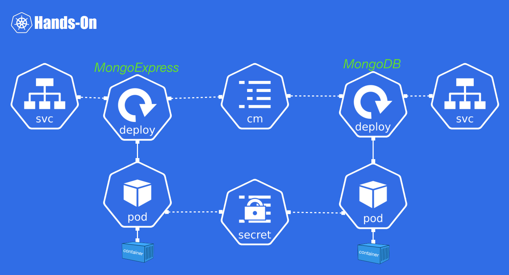

# 🧩 Deploying a MongoDB / Mongo Express Architecture with Minikube

## 🎯 Objective

Use **Minikube** to deploy a simple Kubernetes architecture composed of:
- a **MongoDB** database,
- a **Mongo Express** web interface,
- all running inside a **local Kubernetes cluster**.

> 📸 Target architecture:  
> 

---

## ⚙️ Minikube Installation

### 🧾 Prerequisites
- **Docker Desktop** must be **installed and running**.  
  Minikube relies on Docker to create the local cluster.

### 💻 Installation Command

```bash
curl -LO https://github.com/kubernetes/minikube/releases/latest/download/minikube-linux-amd64
sudo install minikube-linux-amd64 /usr/local/bin/minikube && rm minikube-linux-amd64
```

# 🚀 Starting Minikube

```bash
minikube start
```

Once launched, you should see the minikube container running inside Docker Desktop.

---

# 🏗️ Creating the Kubernetes Architecture

The architecture is defined through YAML configuration files, each describing one or more Kubernetes objects.

## 1️⃣ Create a Namespace

Namespaces group related Kubernetes resources logically (similar to a “resource group”).

```bash
kubectl create namespace mplatteau
```

## 2️⃣ Define Kubernetes Objects
| File                | Object(s) Created   | Description                                                                                          |
|----------------------|--------------------|------------------------------------------------------------------------------------------------------|
| **secret.yaml**      | Secret             | Stores MongoDB credentials (username and password).                                                  |
| **configmap.yaml**   | ConfigMap          | Stores configuration parameters such as the database URL.                                            |
| **mongodb.yaml**     | Deployment & Service | The Deployment creates the MongoDB pod, and the Service exposes it internally under a stable address (`mongodb-service`). |
| **mongo-express.yaml** | Deployment & Service | The Deployment runs the Mongo Express UI, and the Service exposes it so it can be accessed from your browser. |

## 🧱 Apply Configuration Files

Apply all configuration files to the cluster:

```bash
kubectl apply -f secret.yaml
kubectl apply -f configmap.yaml
kubectl apply -f mongodb.yaml
kubectl apply -f mongo-express.yaml
```

💡 Tip: you can apply all YAML files in a folder at once:

```bash
kubectl apply -f .
```

## 🌐 Accessing Mongo Express

After deployment, get the Mongo Express URL with:

```bash
minikube service -n mplatteau mongo-express-service --url
```

This will output something like:

`http://127.0.0.1:xxxxx`


Open that URL in your browser to access the Mongo Express dashboard.

# 🧭 Monitoring and Debugging Tools
## 🔹 Minikube Dashboard
```bash
minikube dashboard
```
Opens a web interface where you can visualize:

- Pods

- Services

- ConfigMaps, Secrets, etc.
in the namespace mplatteau.

## 🔹 List All Resources in the Namespace
```bash
kubectl get all -n mplatteau
```

This command lists all Kubernetes resources created in your namespace.

# ✅ Summary of the Architecture

- Secret → stores MongoDB credentials

- ConfigMap → stores configuration data (like URLs)

- MongoDB Deployment → creates the MongoDB pod

- MongoDB Service → provides a stable internal address

- Mongo Express Deployment → creates the Mongo Express pod

- Mongo Express Service → exposes the UI to the outside world via Minikube

# 🧠 Useful Minikube & kubectl Commands for Beginners

## 🚀 Minikube Management
| Command | Description |
|----------|--------------|
| `minikube status` | Shows the current status of the Minikube cluster (running, stopped, etc.). |
| `minikube stop` | Stops the Minikube cluster (useful to free up resources). |
| `minikube start` | Starts the Minikube cluster. |
| `minikube delete` | Deletes the Minikube cluster and all data. |
| `minikube dashboard` | Opens the Kubernetes dashboard in your browser. |
| `minikube service list` | Lists all services and their URLs (handy to find which ports are exposed). |
| `minikube ip` | Displays the Minikube cluster’s IP address. |
| `minikube logs` | Displays Minikube system logs (useful for debugging startup issues). |
| `minikube addons list` | Lists available Minikube addons (e.g., metrics-server, ingress, dashboard). |
| `minikube addons enable ingress` | Enables an addon, e.g. Ingress controller for routing traffic. |

---

## 🧩 kubectl — Interacting with the Cluster
| Command | Description |
|----------|--------------|
| `kubectl get nodes` | Lists all nodes in your cluster (usually one with Minikube). |
| `kubectl get pods -n mplatteau` | Lists all pods in the given namespace. |
| `kubectl get all -n mplatteau` | Lists all resources (pods, services, deployments, etc.) in the namespace. |
| `kubectl describe pod <pod-name> -n mplatteau` | Shows detailed info about a specific pod (useful for debugging). |
| `kubectl logs <pod-name> -n mplatteau` | Displays logs from a specific pod. |
| `kubectl exec -it <pod-name> -n mplatteau -- /bin/bash` | Opens an interactive shell inside a running pod. |
| `kubectl delete pod <pod-name> -n mplatteau` | Deletes a pod (it will be recreated automatically if managed by a Deployment). |
| `kubectl get services -n mplatteau` | Lists all Services in the namespace. |
| `kubectl get deployments -n mplatteau` | Lists all Deployments. |
| `kubectl describe service <service-name> -n mplatteau` | Shows detailed info about a specific service. |

---

## 🔧 Configuration & Maintenance
| Command | Description |
|----------|--------------|
| `kubectl config get-contexts` | Shows all Kubernetes contexts available on your machine. |
| `kubectl config use-context minikube` | Switches to the Minikube context. |
| `kubectl apply -f <file>.yaml` | Creates or updates a resource from a YAML file. |
| `kubectl delete -f <file>.yaml` | Deletes a resource defined in a YAML file. |
| `kubectl rollout restart deployment <deployment-name> -n mplatteau` | Restarts a deployment (useful after changing a config). |
| `kubectl describe configmap <name> -n mplatteau` | Shows details of a ConfigMap. |
| `kubectl describe secret <name> -n mplatteau` | Shows details of a Secret. |

---

## 🧰 Bonus Tips
| Command | Description |
|----------|--------------|
| `watch kubectl get pods -n mplatteau` | Continuously monitors pods’ status in real time. |
| `kubectl port-forward svc/mongo-express-service 8081:8081 -n mplatteau` | Exposes a service manually on your localhost. |
| `kubectl get events -n mplatteau --sort-by=.metadata.creationTimestamp` | Lists recent Kubernetes events in chronological order. |
| `kubectl top pods -n mplatteau` | Shows CPU and memory usage (requires `metrics-server` addon). |

---

💡 **Tip:** If you ever get lost,

`kubectl explain <resource>`

gives you documentation about any Kubernetes resource (e.g. `kubectl explain deployment`).
